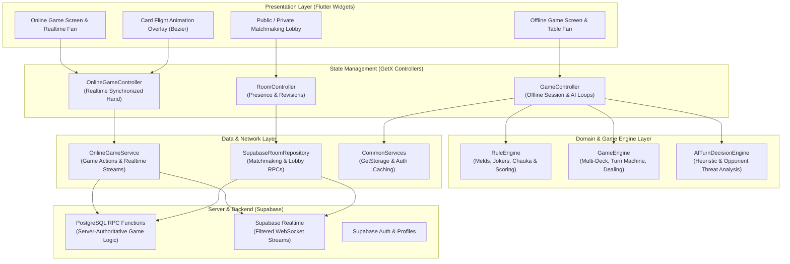

# 🏗️ Architecture & Technical Documentation

This document provides a comprehensive technical overview of the **Multiplayer Card Game** application architecture, game engine rules, AI strategies, real-time database synchronization, performance optimizations, and testing methodologies.

---

## 1. High-Level System Architecture

The application is structured following **Feature-First Clean Architecture** principles with **GetX** for dependency injection and reactive state management, connected to **Supabase (PostgreSQL + Realtime)** for server-authoritative online multiplayer.



---

## 2. Directory Structure

```
lib/
├── core/
│   ├── responsive/         # Screen breakpoint utilities (MediaQuery.sizeOf)
│   ├── router/             # App routing and navigation targets
│   ├── services/           # CommonServices, persistent storage (GetStorage)
│   └── theme/              # CardDimensions, typography, and styling
├── features/
│   ├── ads/                # Google Mobile Ads controllers & BannerAd widgets
│   ├── authentication/     # Google OAuth, guest sign-in, profile synchronization
│   ├── home/               # Primary menu and game mode selection
│   ├── legal/              # Privacy policy and terms presentation
│   ├── offline/            # Offline single-player mode
│   │   ├── ai/             # AI bot strategies (Easy, Medium, Hard, Decision Engine)
│   │   ├── controllers/    # GameController, DeckManager, GameConfig
│   │   ├── engine/         # GameEngine, TurnManager, RuleEngine
│   │   ├── models/         # PlayingCard, CardRank, CardSuit, TableViewState
│   │   └── presentation/   # Offline game screen, table widgets, dealing overlays
│   ├── onboarding/         # Intro walkthrough and game rules tutorial
│   ├── online/             # Real-time multiplayer mode
│   │   ├── create_table/   # Custom table creation (stakes, max players, private)
│   │   ├── join_table/     # Join table by alphanumeric room code
│   │   ├── public_rooms/   # Open matchmaking room browser
│   │   └── room/           # Live game room (OnlineGameController, Realtime service)
│   └── profile/            # User stats, games played, profile editor
└── utils/                  # Constants, custom toasts, formatting helpers
```

---

## 3. Game Rules & Scoring Engine

The game follows a specialized **Indian Marriage / 21-Card Rummy Variant**:

### 3.1 Hand Composition
Each player is dealt **13 cards** from a combined multi-deck pool (2 to 4 decks depending on player count). To win, a player must organize all 13 cards into **4 valid sets**:
- Three sets of 3 cards + One set of 4 cards (or two sets of 4 + two sets of 3 depending on mode).
- In this game variant, valid sets are strictly **Rank Melds** (cards sharing the same rank, e.g., `8♠ 8♥ 8♦` or `K♠ K♥ K♦ K♣`).

### 3.2 Hidden Wild Joker & 4th Card (Chauka)
1. At the start of each round, a **Hidden Joker** card is cut face-down.
2. Players cannot use the Joker as a wildcard initially.
3. **Unlocking Mechanic**: To unlock the Joker, a player must form a natural **4th Card (Chauka)**—four cards of the exact same natural rank (e.g., `7♠ 7♥ 7♦ 7♣`).
4. Once declared via `validate4thCard()` / `unlock_joker` RPC:
   - The wild Joker rank is revealed to the player.
   - Any card matching the Joker's rank can now substitute for any missing card in the player's remaining sets.

### 3.3 Score Calculation Table
When a player declares a show (`validateEndGame()`):
- **Show Caller Bonus**: +40 points.
- **4th Card Bonus**: +20 points for holding a declared Chauka.
- **Rank Melds**:
  - 3 cards of same rank: +20 points.
  - 4 cards of same rank: +20 points (or +35 points if upgraded with 2 jokers).
  - 5 cards of same rank: +30 points (+35 with 1 joker).
  - 6 cards of same rank: +40 points.
  - 7 cards of same rank: +40 points (+55 with 2 jokers).
  - 8 cards of same rank: +50 points (+55 with 1 joker).
  - 9 cards of same rank: +60 points.
- **Pure Jokers Collection**:
  - 3 Jokers: +20 points.
  - 4–5 Jokers: +30 points.
  - 6+ Jokers: +40 points.

---

## 4. Offline Game Engine & AI Opponents

### 4.1 State Management & Turn Phasing
- `GameEngine`: Owns the multi-deck cards pool, shuffles, distributes hands, and cuts the initial open card and hidden joker.
- `TurnManager`: Enforces strict two-phase turns:
  1. `waitingForDraw`: Player must draw from either the closed deck or the open forward card pile.
  2. `waitingForDiscard`: Player selects a card from their hand and passes/discards it to the open pile. Turn automatically advances to the next seat.

### 4.2 Asynchronous AI Loop Safety
AI opponent turns run asynchronously using delayed animations to simulate human thinking time:
```dart
Future<void> _playOpponentTurns() async {
  final session = gameSessionId;
  while (_engine.turnManager.currentPlayer != 0 && !_engine.turnManager.isFinished) {
    if (session != gameSessionId) return; // Immediate cancellation if restarted/exited
    ...
  }
}
```
Whenever `initializeGame()` or `restart()` is triggered, `gameSessionId` is regenerated. Ongoing AI loops from previous rounds detect the session mismatch and terminate immediately, eliminating state race conditions and memory leaks.

### 4.3 AI Strategies
1. **Easy (`EasyAIStrategy`)**:
   - Randomly chooses between drawing from the deck or taking the open card if it forms a pair.
   - Discards a random card that does not break an existing pair.
2. **Medium (`MediumAIStrategy`)**:
   - Evaluates the open card to check if it completes a 3-of-a-kind set.
   - Retains existing pairs and discards isolated single cards of high rank.
3. **Hard (`HardAIStrategy`)**:
   - Uses `AITurnDecisionEngine` to calculate complete game state context.
   - Evaluates opponent hand sizes and computes threat levels ($0.0$ to $1.0$).
   - Avoids discarding cards that opponents are known or estimated to need.
   - Proactively prioritizes forming a 4-of-a-kind to unlock the wild Joker early.

---

## 5. Online Multiplayer & Supabase Architecture

### 5.1 Server-Authoritative Anti-Cheat
All critical game mutations are executed through PostgreSQL stored procedures with Row Level Security (RLS):
- `create_table`: Creates room record, generates join code, registers host.
- `join_game_room`: Enforces player capacity and assigns seats.
- `draw_from_deck` / `draw_from_open_card`: Atomically reassigns card zone from `deck` or `open_pile` to `player_hand`.
- `discard_card`: Moves card to `discard_pile` and advances `current_player_id`.
- `claim_victory`: Server validates that all 4 sets are legal before marking the room as finished.

### 5.2 Realtime Stream Filtering
To prevent streaming every card across the database to all clients, queries are strictly scoped:
```dart
_supabase.from('game_cards')
    .stream(primaryKey: ['id'])
    .eq('room_id', roomId) // Server-side filter
```
This reduces mobile data consumption by >90% and ensures clients only receive updates relevant to their active match.

### 5.3 Optimistic Concurrency & Reconnection
- `watchLobbyRevision`: Listens for integer revision bumps (`revision > current.revision`) to update lobby state.
- `discoverRejoinableSessions`: If a player disconnects due to network loss, the client queries active rooms where the user's `player_id` is seated, allowing instant session resumption with full hand restoration.

---

## 6. Rendering & Performance Optimizations

1. **Card Texture Bitmap Caching**:
   - `assets/images/card_back.png` (3.0 MB, 1048x1501 px) is used across ~45 miniature cards simultaneously.
   - Configured with `cacheWidth: 200` in `CardBack`, saving ~50 MB of VRAM and preventing frame drops during animations.
2. **Selective Media Query Rebuilding**:
   - Replaced `MediaQuery.of(context).size` with `MediaQuery.sizeOf(context).width` in `CardDimensions` and `GetDevice`.
   - Prevents entire card layouts from rebuilding when system keyboard toggles or status bar insets shift.
3. **Index Bounds Protection**:
   - Card tile widgets implement bounds checks (`if (index >= list.length) return const SizedBox.shrink();`) to guard against transient `RangeError` during rapid hand rebuilds.
4. **Bezier Trajectory Card Flight**:
   - `CardAnimationOverlay` calculates parabolic arcs using quadratic Bezier formulas:
     $$B(t) = (1-t)^2 P_0 + 2(1-t)t P_1 + t^2 P_2$$
   - Computes control peak midpoints dynamically between source and destination RenderBoxes.

---

## 7. Testing & Quality Assurance

The codebase includes an automated test suite passing with **100% success rate**:
- **Rules Engine Tests** ([`rule_engine_test.dart`](file:///Users/vijaypamu/Desktop/flutter_projects/card_game/test/features/offline/engine/rule_engine_test.dart)):
  - Validates 4th card Chauka (exactly 4 matching ranks).
  - Validates full hands (4 legal sets) with both locked and unlocked jokers.
  - Verifies rejection of invalid wildcard sets and order independence.
  - Tests score calculation with Chauka and show caller bonuses.
- **Payment State Machine Tests**:
  - Full lifecycle test coverage for payment transitions (pending, authorized, captured, failed).
  - Webhook ordering and idempotency protection against duplicate network events.
- **UI & Controller Tests**:
  - Screen navigation, page transitions, onboarding controls, and authentication states.

To run the verification suite:
```bash
flutter analyze
flutter test
```
